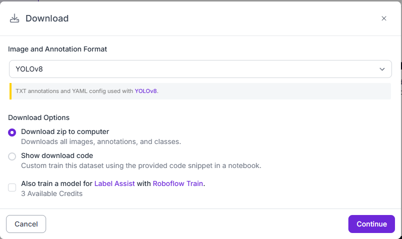

# Navodila

## Idi na naš roboflow in naloži dataset (format YOLO8 Zip)


## V projektu naloži:
```python
pip install ultralytics
```
## Treniraj na CUDA (hitreje):

```python
pip3 install torch torchvision --index-url https://download.pytorch.org/whl/cu130
```
*če ti dela cuda lahko preveriš v cudatest.py*

#### Rezultati naučenega modela so shranjeni v:
```python
\bkeep-vid\runs\detect\train
```

*Če jih rabiš mi reči da ti jih pošlem prek driva al pa USB kr so v gitignore*